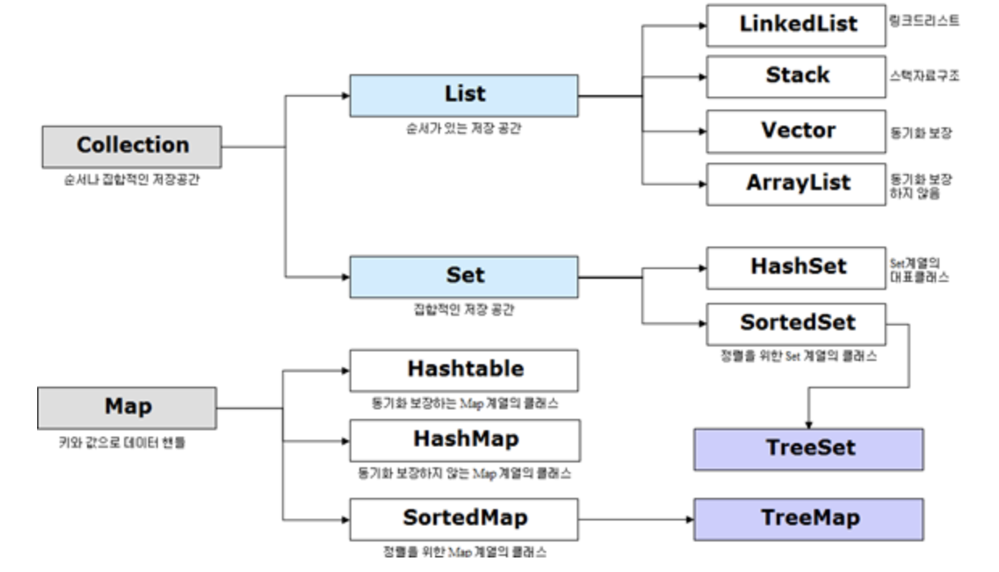
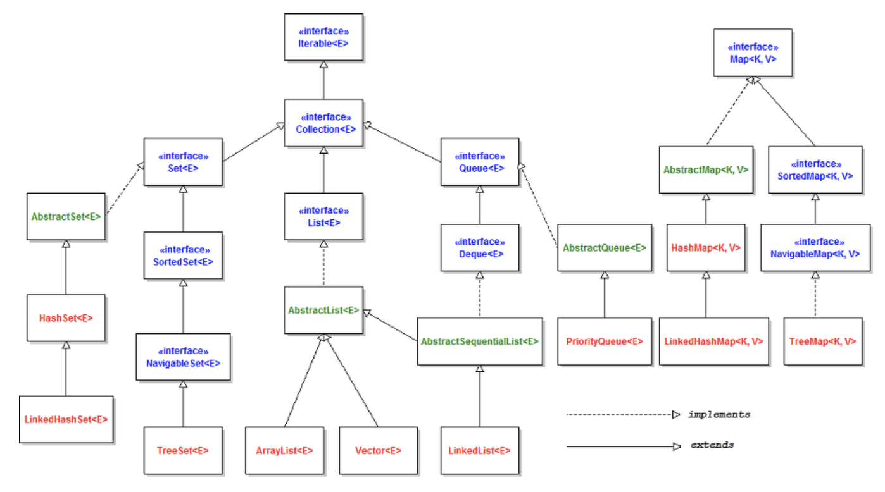

# 4.Collection : 데이터의 그룹, 집합

Java Collection 에는 `List`, `Map`, `Set` 인터페이스를 기준으로 여러 구현체가 존재한다. 이에 더해 `Stack`과 `Queue` 인터페이스도 존재한다. 왜 이러한 Collection 을 사용하는 것일까? 그 이유는 다수의 Data 를 다루는데 표준화된 클래스들을 제공해주기 때문에 DataStructure 를 직접 구현하지 않고 편하게 사용할 수 있기 때문이다. 또한 배열과 다르게 객체를 보관하기 위한 공간을 미리 정하지 않아도 되므로, 상황에 따라 객체의 수를 동적으로 정할 수 있다. 이는 프로그램의 공간적인 효율성 또한 높여준다.

|인터페이스|구현클래스|특징|
|:--:|:--:|:--:|
|Set|HashSet, TreeSet|순서를 유지하지 않는 데이터의 집합으로 데이터의 중복을 허용하지 않는다. |
|List|LinkedList, Vector, ArrayList|순서가 있는 데이터의 집합으로 데이터의 중복을 허용한다.|
|Queue|LinkedList, PriorityQueue|List와 유사|
|Map|Hashtable, HashMap, TreeMap|키,값의 쌍으로 이루어진 데이터의 집합으로, 순서는 유지되지 않으며 키의 중복을 허용하지 않으나 값의 중복은 허용한다.|

|인터페이스|하위|특징|
|:--:|:--:|:--:|
|Set|HashSet|가장 빠른 임의 접근 속도, 순서를 예측할 수 없음.|
||TreeSet|정렬방법을 지정할 수 있음.|
|List|ㅣLinkedList|양방향 포인터 구조로 데이터의 삽입, 삭제가 빈번할 경우 데이터의 위치정보만 수정하면 되기에 유용, 스택,큐, 양방향 큐 등을 만들기 위한 용도로 쓰임|
||Vector|과거에 대용량 처리를 위해 사용했으며, 내부에서 자동으로 동기화처리가 일어나 비교적 성능이 좋지 않고 무거워 잘 쓰이지 않음|
||ArrayList|단방향 포인터 구조로 각 데이터에 대한 인덱스를 가지고 있어 조회 기능에 성능이 뛰어남|
|Map|HashTable|HashMap보다는 느리지만 동기화 지원, null 불가|
||HashMap|중복과 순서가 허용되지 않으며 null값이 올 수 있다.|
||TreeMap|정렬된 순서대로 키와 값을 저장하여 검색이 빠름|

* List  
  `List` 인터페이스를 직접 `@Override`를 통해 사용자가 정의하여 사용할 수도 있으며, 대표적인 구현체로는 `ArrayList`가 존재한다. 이는 기존에 있었던 `Vector`를 개선한 것이다. 이외에도 `LinkedList` 등의 구현체가 있다.
* Map  
  대표적인 구현체로 `HashMap`이 존재한다. (밑에서 살펴볼 멀티스레드 환경에서의 개발 부분에서 HashTable 과의 차이점에 대해 살펴본다.) key-value 의 구조로 이루어져 있으며 Map 에 대한 구체적인 내용은 DataStructure 부분의 hashtable 과 일치한다. key 를 기준으로 중복된 값을 저장하지 않으며 순서를 보장하지 않는다. key 에 대해서 순서를 보장하기 위해서는 `LinkedHashMap`을 사용한다.
* Set  
  대표적인 구현체로 `HashSet`이 존재한다. `value`에 대해서 중복된 값을 저장하지 않는다. 사실 Set 자료구조는 Map 의 key-value 구조에서 key 대신에 value 가 들어가 value 를 key 로 하는 자료구조일 뿐이다. 마찬가지로 순서를 보장하지 않으며 순서를 보장해주기 위해서는 `LinkedHashSet`을 사용한다.
* Stack 과 Queue  
  `Stack` 객체는 직접 `new` 키워드로 사용할 수 있으며, `Queue` 인터페이스는 JDK 1.5 부터 `LinkedList`에 `new` 키워드를 적용하여 사용할 수 있다. 자세한 부분은 DataStructure 부분의 설명을 참고하면 된다.

 
---
# 총정리

## 자바 컬렉션 프레임워크(Java Collection Framework)

>배열을 보완하는 컬렉션(Collection)

컬렉션(Collection)은 여러 요소들을 담을 수 있는 자료구조다. 즉, 다수의 데이터 그룹이며 다른 말로 컨테이너(Container)라고도 부른다. 배열과 비슷하지만 크기가 고정된 배열을 보완하여 Re-sizable 한 특성을 가진다.

자바 초기에는 Vector, Stack, HashTable 등의 컬렉션 클래스만 제공했으나, 자바 1.2 이후 표준적인 방식으로 컬렉션을 다루기 위한 **컬렉션 프레임워크(Collection Framework)**가 등장하였다. 모든 컬렉션 클래스명은 구현한 인터페이스명이 포함되어 있어서 바로 클래스의 특징을 알 수 있다. 예를 들어 HashMap 클래스는 Map 인터페이스를 구현한 것이다. 단, Vector, Stack, HashTable처럼 컬렉션 프레임워크 이전부터 존재하던 컬렉션 클래스(Legacy Class)는 이러한 명명법을 따르지 않는다.

**결론은 컬렉션 프레임워크는 배열의 문제점을 해결하고, 널리 알려져 있는 자료구조를 바탕으로 객체들을 효율적으로 추가, 삭제, 검색할 수 있도록 java.util 패키지에 컬렉션과 관련된 인터페이스와 클래스들을 포함시킨 것이다.**

컬렉션 프레임워크의 장점
별도로 컬렉션 클래스를 구현하는 것보다 이미 구현되어 있는 것을 사용함으로써 코딩 시간을 감소시킬 수 있다. 컬렉션 프레임워크들은 잘 테스트되고 검증되어 있기 때문에 코드 품질을 보장한다. JDK에 포함된 컬렉션 프레임워크들을 사용하여 코드 유지보수 시간을 감소시킬 수 있다. 재사용 가능하고 상호 운용성이 보장된다.

컬렉션 프레임워크 계층구조 예시

### 컬렉션 프레임워크 구성요소
- 컬렉션 인터페이스 : 모든 컬렉션 인터페이스는 java.util 패키지에 있다.
- 컬렉션 클래스 : 모든 컬렉션 클래스는 java.util 또는 java.util.concurrent 패키지에 있다.
- 컬렉션 알고리즘 : 검색, 정렬, 셔플과 같은 기능을 제공한다.
[java.util](https://docs.oracle.com/javase/9/docs/api/java/util/package-summary.html) [java.util.concurrent](https://docs.oracle.com/javase/9/docs/api/java/util/concurrent/package-summary.html)

### 컬렉션 인터페이스(Collection Interface)
#### 제네릭(Generics)으로 표현

컬렉션 인터페이스들은 제네릭(Generics)으로 표현되어 컴파일 시점에서 객체의 타입을 체크하기 때문에 런타임 에러를 줄이는 데 도움이 된다. 예를 들어 런타임 시 발생하는 ClassCastException을 컴파일 시점에서 찾아낼 수 있다. 또한 클래스 캐스팅을 하지 않아도 되고 instansof를 사용하지 않아도 되므로 코드를 좀 더 깔끔하게 유지할 수 있다.

### 컬렉션 프레임워크 대표적인 인터페이스
- List 인터페이스
- Set 인터페이스
- Map 인터페이스
List, Set 인터페이스는 Collection 인터페이스를 상속받는다. 따라서 List 인터페이스와 Set 인터페이스의 공통된 부분을 Collection 인터페이스에서 정의하고 있다. 반면 Map 인터페이스는 구조상의 차이(Key-Value)로 인해 Collection 인터페이스를 상속받지 않고 별도로 정의된다.

컬렉션 인터페이스를 하나씩 살펴보자. 컬렉션 인터페이스를 크게 3가지로 분류할 것이다. (Collection 인터페이스 그룹/ Map 인터페이스 그룹/ 기타 인터페이스 그룹)

## 1. Collection 인터페이스 그룹
### 1.1 Collection 인터페이스
Collection 인터페이스는 직접적인 구현은 제공하지 않으며 모든 컬렉션 클래스가 구현해야 하는 메서드들을 포함하고 있다. 아래는 대표적인 메서드들이다.

- boolean add(E e) : 해당 컬렉션에 전달된 요소를 추가
- boolean remove(Object o) : 해당 컬렉션에서 전달된 객체를 제거
- void clear() : 해당 컬렉션의 모든 요소를 제거
- boolean contains(Object o) : 해당 컬렉션이 전달된 객체를 포함하고 있는지
- boolean equals(Object o) : 해당 컬렉션과 전달된 객체가 같은지
- boolean isEmpty() : 해당 컬렉션이 비어있는지
- Iterator <E> iterator() : 해당 컬렉션의 반복자(iterator)를 반환
- int size() : 해당 컬렉션의 요소의 총개수를 반환
- Object [] toArray() : 해당 컬렉션의 모든 요소를 Object 타입의 배열로 반환

### 1.2 List 인터페이스
List 인터페이스는 순서가 있는 컬렉션이며 중복 요소를 포함할 수 있다. 인덱스로 모든 요소에 접근할 수 있으며, List 인터페이스로 구현된 클래스는 ArrayList, LinkedList, Vector, Stack 이 있다.

### 1.3 Set 인터페이스
Set 인터페이스는 중복 요소를 포함할 수 없으며 랜덤 액세스(Random access)를 허용하지 않으므로, iterator 또는 foreach를 이용하여 요소를 탐색할 수 있다. Set 인터페이스로 구현된 클래스는 HashSet, TreeSet, LinkedHashSet 이 있다.

### 1.4 SortedSet 인터페이스
SortedSet 인터페이스는 요소를 오름차순으로 유지하는 Set이다. SortedSet 인터페이스로 구현된 클래스는 TreeSet 이 있다.

### 1.5 Queue 인터페이스
Queue 인터페이스는 처리하기 전에 요소를 보유하는 데 사용된다. 기본 컬렉션 작업 외에도 Queue는 삽입, 추출 및 검사 작업을 제공한다. 일반적으로 Queue는 요소를 FIFO 방식으로 정렬하며 예외에는 우선순위 큐가 있다. Quque 인터페이스로 구현된 클래스는 PriorityQueue 이 있다.

### 1.6 Deque 인터페이스
Deque 인터페이스는 양쪽 끝에 요소 삽입 및 제거를 지원한다. "double ended queue"의 약자이며 데크라고 읽는다. Deque 인터페이스로 구현된 클래스는 ArrayDeque 이 있다.

[Collection](https://docs.oracle.com/javase/9/docs/api/java/util/Collection.html)

## 2. Map 인터페이스 그룹
### 2.1 Map 인터페이스
Map 인터페이스는 키와 값을 매핑한다. 중복 키가 존재할 수 없으며 각 키는 하나의 값만 매핑할 수 있다. Map의 기본 연산은 put, get, containsKey, containsValue, size, isEmpty 등이 있다. Map 인터페이스로 구현된 클래스는 HashMap, TreeMap, LinkedHashMap, Hashtable, Properties 이 있다.

### 2.2 SortedMap 인터페이스
SortedMap 인터페이스는 매핑을 오름차순의 키 순서로 유지하는 Map이다. SortedMap 인터페이스로 구현된 클래스는 TreeMap 이 있다.

## 3. 기타 인터페이스 그룹
### 3.1 Iterator 인터페이스
Iterator 인터페이스는 어떤 컬렉션이든 반복적으로 수행하기 위한 메서드를 제공한다. 컬렉션 프레임워크에서는 Enumeration 대신 Iterator를 사용하며, 컬렉션 클래스의 Iterator는 Iterator 디자인 패턴을 구현한다. iterator 메서드를 통해 컬렉션으로부터 iterator instance를 가져올 수 있고 컬렉션을 순회하는 도중에 엘리먼트들을 삭제할 수 있다.

### 3.2 ListIterator 인터페이스
ListIterator 인터페이스는 어느 방향이든 목록을 탐색하고 반복하면서 목록을 수정하고, 목록에서 반복자의 현재 위치를 가져올 수 있다. ListIterator에는 현재의 요소가 없다. 커서 위치는 항상 previous()에 대한 호출에 의해 반환될 요소와 next()에 대한 호출에 의해 반환될 요소 사이에 위치한다.

### 3.3 Concurrent 인터페이스 그룹
Concurrent 인터페이스 그룹은 아래와 같다.

- BlockingQueue 인터페이스
- TransferQueue 인터페이스
- BlockingDeque 인터페이스
- ConcurrentMap 인터페이스
- ConcurrentNavigableMap 인터페이스

# 컬렉션 클래스(Collection Class)
---
컬렉션 프레임워크는 컬렉션 인터페이스에 대한 구현 클래스를 제공한다. 컬렉션 클래스의 종류는 아래와 같다. 이 중에서 일반적으로 쓰이는 클래스와 Concurrent 클래스만 본문에서 다룰 것이다. (파란색으로 표시된)

- **일반적으로 쓰이는 클래스** : ArrayList, LinkedList, HashSet, TreeSet, PriorityQueue, ArrayDeque, HashMap, TreeMap, LinkedHashMap
- **Concurrent 클래스** : CopyOnWriteArrayList, ConcurrentHashMap, CopyOnWriteArraySet
- **Legacy 클래스** : Vector, Stack, Dictionary, Hashtable, Properties
- **Abstract 클래스** : AbstractList, AbstractSequenctailList, AbstractSet, AbstractQueue

## 4. Collection 인터페이스 그룹의 클래스
### 4.1 ArrayList 클래스
ArrayList 클래스는 resizable-array이면서 비동기이다. 만약 동기화가 필요할 때는 Collections.synchronizeList() 메서드를 통해 동기화가 보장되는 List를 반환받아 사용한다. ArrayList 클래스와 유사한 Vector 클래스는 resizable-array이고 동기화를 보장한다. 참고로 ArrayList 클래스는 내부적으로 배열을 이용하여 요소를 저장한다.

### 4.2 LinkedList 클래스
LinkedList 클래스는 Queue, Deque 속성과 메서드를 가지고 있고 비동기이다. 만약 동기화가 필요할 때는 Collections.synchronizeList() 메서드를 통해 동기화가 보장되는 List를 반환받아 사용한다. ArrayList 클래스의 주요 메서드뿐 만 아니라 Queue, Deque의 메서드도 포함되어 있다. 참고로 LinkedList 클래스는 내부적으로 연결 리스트를 이용하여 요소를 저장한다.

### 4.3 HashSet 클래스
HashSet 클래스는 HashMap에 의해 지원되는 Set 인터페이스의 구현체이다. set의 반복 순서를 보장하지 않으며 null 요소를 허용한다.

### 4.4 TreeSet 클래스
Tre eSet 클래스는 TreeMap이 근본이 되는 NavigableSet 구현이다.

### 4.5 PriorityQueue 클래스
PriorityQueue 클래스는 Queue는 FIFO 순서로 요소를 처리하지만, 때로는 우선순위에 따라 요소를 처리하기를 원할 경우 PriorityQueue를 사용할 수 있다.

### 4.6 ArrayDeque 클래스
ArrayDeque 클래스.

## 5. Map 인터페이스 그룹의 클래스
### 5.1 HashMap 클래스
HashMap 클래스는 비동기이며 null을 허용한다는 점을 제외하면 Hashtable과 유사하다. 맵의 순서를 보증하지 않는다.

### 5.2 TreeMap 클래스
TreeMap 클래스.

### 5.3 LinkedHashMap 클래스
LinkedHashMap 클래스.

## 6. 기타 인터페이스 그룹의 클래스
### 6.1 Concurrent 클래스 그룹
Java 1.5에서 Concurrent 패키지(java.util.concurrent)에는 반복하는 동안 컬렉션을 수정할 수 있는 thread-safe 한 컬렉션 클래스가 포함되어 있다. 대표적으로 CopyOnWriteArrayList, ConcurrentHashMap, CopyOnWriteArraySet가 있다.

- LinkedBlockingQueue
- ArrayBlockingQueue
- PriorityBlockingQueue
- DelayQueue
- SynchronousQueue
- LinkedBlockingDeque
- LinkedTransferQueue
- CopyOnWriteArrayList
- CopyOnWriteArraySet
- ConcurrentSkipListSet
- ConcurrentHashMap
- ConcurrentSkipListMap

# 컬렉션 알고리즘(Collection Algorithm)
Collections 클래스는 모든 컬렉션의 알고리즘(Algorihtm)을 담당한다. 유틸리티 클래스로, static 메서드로 구성되어 있고 컬렉션들을 컨트롤하는 데 사용된다. Collections 클래스는 정렬, 셔플링, 이진 검색, 뒤집기 등의 메서드를 가지고 있다. 주의할 점은 **자바의 Collection은 인터페이스이며, Collections는 클래스**라는 점이다.

##### 정렬(Sorting)
정렬 알고리즘은 요소가 오름차순이 되도록 리스트를 재 정렬한다.

##### 셔플링(Shuffling)
셔플링 알고리즘은 랜덤으로 목록을 재 정렬한다. 이 알고리즘은 우연한 게임을 구현할 때 유용하다.

##### 탐색(Searching)
이진 검색 알고리즘은 정렬된 목록에서 지정된 요소를 검색한다.

|컬렉션 클래스|순서|랜덤 액세스|키값|중복요소|널요소|스레드 안전|
|:--:|:--:|:--:|:--:|:--:|:--:|:--:|
|ArrayList|O|O||O|O||
|LinkedList|O|||O|O||
|~~Vector~~|O|O||O|O|O|
|~~Stack~~|O|||O|O|O|
|HashSet|||||O||
|TreeSet|O||||||
|HashMap||O|O||O||
|TreeMap|O|O|O||||
|~~Hashtable~~||O|O||O||
|~~Properties~~||O|O||O||
|CopyOnWriteArrayList|O|O||O|O|O|
|CopyOnWriteArraySet|||||O|O|
|ConcurrentHashMap||O|O|||O|

## 컬렉션 프레임워크의 모범 사례
필요에 따라 상황에 맞는 컬렉션을 선택해야 된다. 

- 크기(size)가 고정되어 있다면 **ArrayList**보다 **Array**를 사용하라.
맵에 삽입된 순서대로 iterate를 하고 싶으면 **TreeMap**을 사용하는 것이 좋다. 
- 중복을 허용하고 싶지 않으면 **Set**을 사용하면 된다.
몇몇 컬렉션 클래스들을 초기 용량을 지정할 수 있다. 만약 저장할 요소들의 사이즈를 알 경우에 초기 용량을 지정함으로써 rehashing이나 resizing이 일어나는 것을 회피할 수 있다.
- 코드를 작성할 때, 구현 클래스가 아닌 **인터페이스를 기반으로 작성**해야 나중에 구현체를 변경할 때 코드를 재작성하는 수고를 줄일 수 있다. 
- 런타임에 발생할 수 있는 ClassCastException을 회피하려면 항상 **제네릭(Generics)** 을 사용해서 type-safety 한 상태를 유지하라.
- 맵에 키를 사용할 때 JDK에서 제공하는 immutable 클래스를 사용하여 사용자 클래스에서 **hashCode()와 equals() 구현할 필요가 없게 하라**
- 읽기 전용 및 동기화, 빈 컬렉션 등을 만들 때는 자신만의 구현으로 생성하지 말고 Collections에서 제공하는 유틸리티 클래스를 사용하라. 이는 코드 재사용성을 높여주고 안정적이며 유지보수 비용을 줄여 준다.
