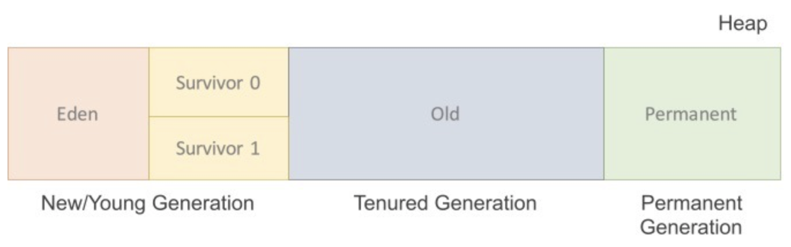
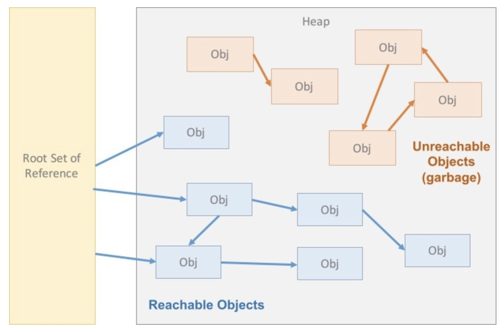
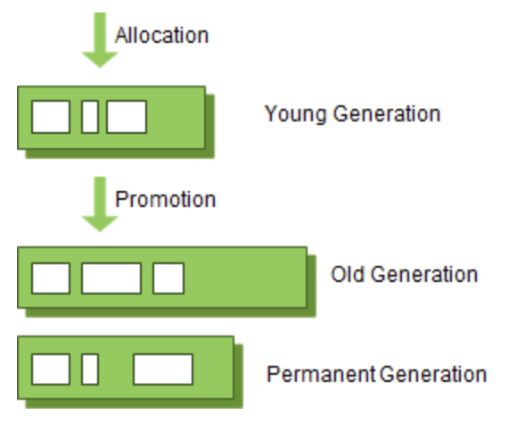
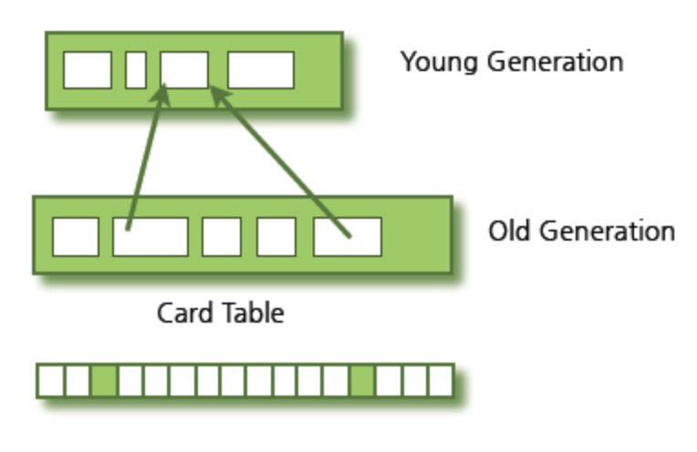
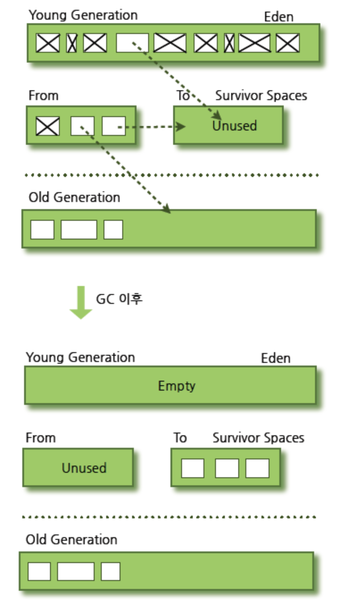
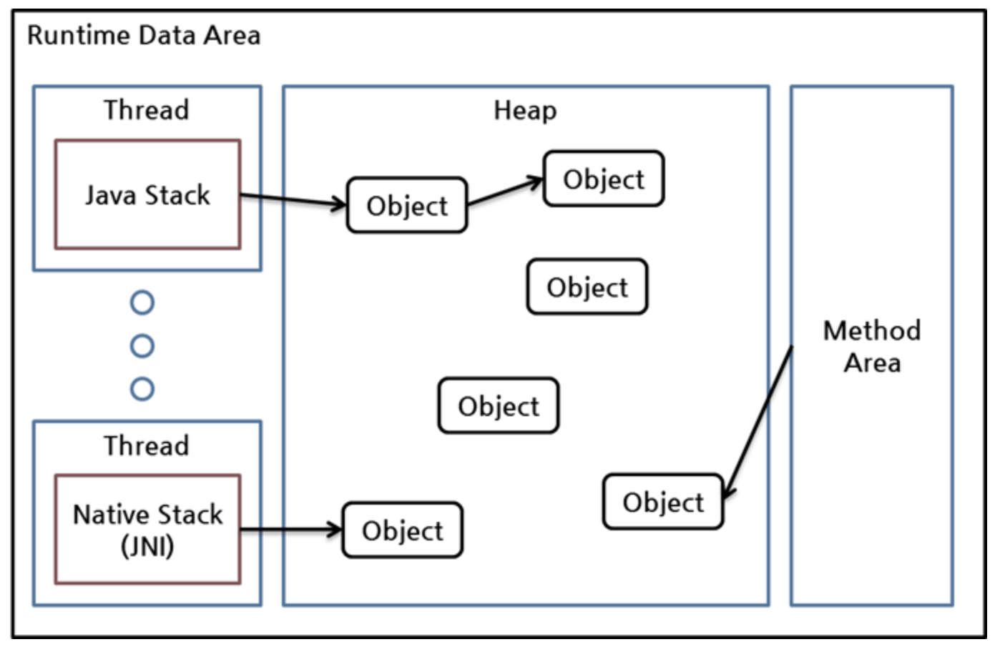
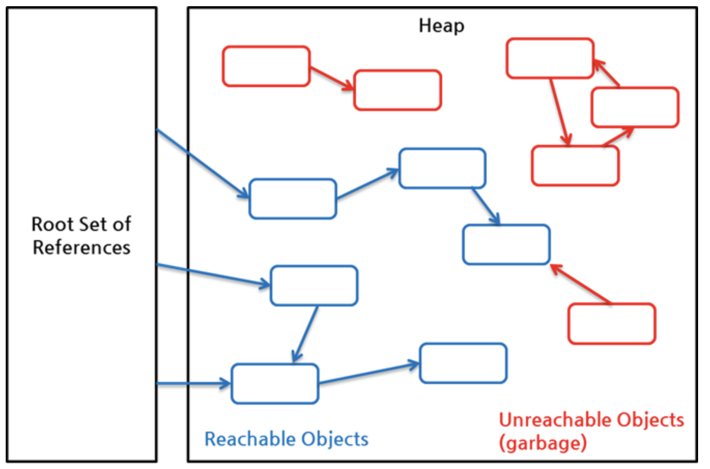
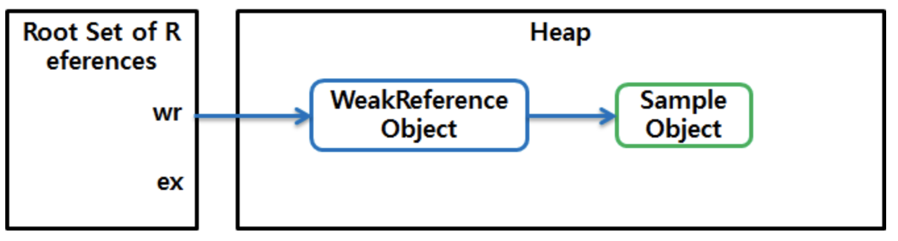
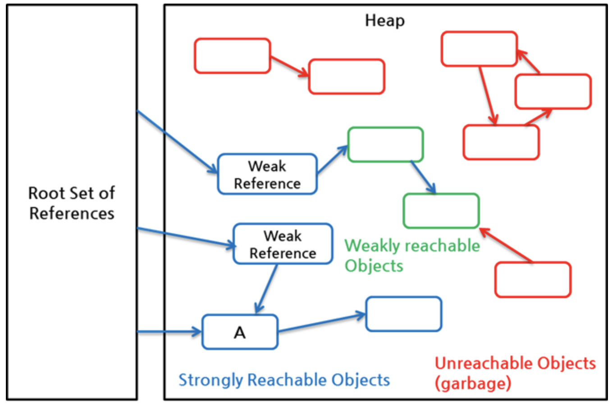
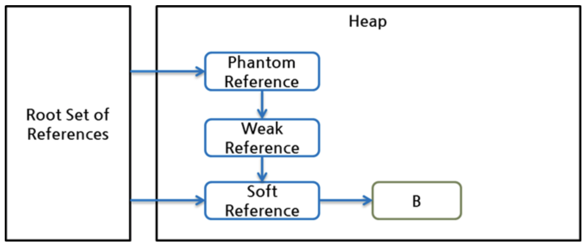

# 1. Garbage Collection

#가비지 컬렉션, GC(Garbage Collection)

||
|:--:|
|구조|


### Minor GC
새로 생성된 대부분의 객체(Instance)는 Eden 영역에 위치한다. Eden영역에서 GC가 한 번 발생한 후 살아남은 객체는 Survivor 영역 중 하나로 이동된다. 이 과정을 반복하다가 계속해서 살아남아 있는 객체는 일정시간 참조되고 있다는 뜻이므로 Old영역으로 이동시킨다.

### Major GC
Old영역에 있는 모든 객체들을 검사하여 참조되지 않은 객체들을 한꺼번에 삭제한다. 시간이 오래 걸리고 실행 중 프로세스가 정지된다. 이것을 `stop-the-world`라고 하는데 Major GC가 발생하면 GC를 실행하는 스레드를 제외한 나머지 스레드는 모두 작업을 멈춘다. GC 작업을 완료한 이후에야 중단했던 작업을 다시 시작한다.

가비지 컬렉션은 어떤 원리로 소멸시킬 대상을 선정하는가?
알고리즘에 따라 동작 방식이 매우 다양하지만 공통적인 원리가 있다. Gargabe Collector는 힙 내의 객체 중에서 가비지(Garbage)를 찾아내고 찾아낸 가비지를 처리해서 힙의 메모리를 회수한다. 참조되고 있지 않은 객체(Instance)를 가비지라고 하며 객체가 가비지인지 아닌지 판단하기 위해서 reachability라는 개념을 사용한다. 어떤 힙 영역에 할당된 객체가 유효한 참조가 있으면 reachability, 없다면 unreachability로 판단한다. 하나의 객체는 다른 객체를 참조하고, 다른 객체는 또 다른 객체를 참조할 수 있기 때문에 참조 사슬이 형성이 되는데, 이 참조 사슬 중 최초에 참조한 것을 Root Set이라고 칭한다. 힙 영역에 있는 객체들은 총 4가지 경우에 대한 참조를 하게 된다.

||
|:--:|
|참조 사슬|

1= 힙 내의 다른 객체에 의한 참조
2= Java스택, 즉 Java 메서드 실행 시에 사용하는 지역변수와 파라미터들에 의한 참조
3= 네이티브 스택(JNI, Java Native Interface)에 의해 생성된 객체에 대한 참조
4= 메서드 영역의 정적 변수에 의한 참조
2,3,4 는 Root set이다.
즉 참조 사슬 중 최초에 참조한 것이다.

인스턴스가 가비지 컬렉션의 대상이 되었다고 해서 바로 소멸이 되는 것은 아니다. 빈번한 가비지 컬렉션의 실행은 시스템에 부담이 될 수 있기에 성능에 영향을 미치지 않도록 가비지 컬렉션 실행 타이밍은 별도의 알고리즘을 기반으로 계산이 되며, 이 계산결과를 기반으로 가비지 컬렉션이 수행된다.

### Serial GC
적은 메모리와 CPU 코어 개수가 적을 때 적합한 방식으로 Young 영역에서는 
### Parallel GC
기본적인 GC 알고리즘은 Serial GC와 동일하지만 Parallel GC는 GC를 처리하는 스레드가 여러 개라서 보다 빠른 GC를 수행할 수 있다. 메모리가 충분하고 코어의 개수가 많을 때 유리하다.
### Parallel Old GC(Parallel Compacting GC)
JDK 5 update 6부터 제공한 GC방식이다. 별도로 살아있는 객체를 식별한다는 부분에서 보다 복잡한 단계로 수행된다.
+ Concurrent Mark & Sweep GC(이하 CMS)
+ G1(Garbage First) GC


##### 참고사이트
[Garbage Collection 에 대해서](http://asfirstalways.tistory.com/159)


# 2. Java Garbage Collection

>자바의 경우 Managed Language로서, 메모리 관리를 도와주는 것들 중 특히 가비지 컬렉션에 대해서 제대로 알아야한다고 생각한다. 네이버 D2의 글을 참고해서 작성하였음.


## 가비지 컬렉션 과정 - Generational Garbage Collection
GC에 대해서 알아보기 전에 알아야 할 용어가 있다. 바로 'stop-the-world'이다. stop-the-world란, GC을 실행하기 위해 JVM이 애플리케이션 실행을 멈추는 것이다. stop-the-world가 발생하면 GC를 실행하는 쓰레드를 제외한 나머지 쓰레드는 모두 작업을 멈춘다. GC 작업을 완료한 이후에야 중단했던 작업을 다시 시작한다. 어떤 GC 알고리즘을 사용하더라도 stop-the-world는 발생한다. 대개의 경우 GC 튜닝이란 이 stop-the-world 시간을 줄이는 것이다.

Java는 프로그램 코드에서 메모리를 명시적으로 지정하여 해제하지 않는다. 가끔 명시적으로 해제하려고 해당 객체를 null로 지정하거나 System.gc() 메서드를 호출하는 개발자가 있다. null로 지정하는 것은 큰 문제가 안 되지만, System.gc() 메서드를 호출하는 것은 시스템의 성능에 매우 큰 영향을 끼치므로 System.gc() 메서드는 절대로 사용하면 안 된다(다행히도 NHN에서 System.gc() 메서드를 호출하는 개발자를 보진 못했다).

Java에서는 개발자가 프로그램 코드로 메모리를 명시적으로 해제하지 않기 때문에 가비지 컬렉터(Garbage Collector)가 더 이상 필요 없는 (쓰레기) 객체를 찾아 지우는 작업을 한다. 이 가비지 컬렉터는 두 가지 가설 하에 만들어졌다(사실 가설이라기보다는 가정 또는 전제 조건이라 표현하는 것이 맞다).
- 대부분의 객체는 금방 접근 불가능 상태(unreachable)가 된다.
- 오래된 객체에서 젊은 객체로의 참조는 아주 적게 존재한다.

이러한 가설을 'weak generational hypothesis'라 한다. 이 가설의 장점을 최대한 살리기 위해서 HotSpot VM에서는 크게 2개로 물리적 공간을 나누었다. 둘로 나눈 공간이 Young 영역과 Old 영역이다.

- Young 영역(Yong Generation 영역): 새롭게 생성한 객체의 대부분이 여기에 위치한다. 대부분의 객체가 금방 접근 불가능 상태가 되기 때문에 매우 많은 객체가 Young 영역에 생성되었다가 사라진다. 이 영역에서 객체가 사라질때 Minor GC가 발생한다고 말한다.
- Old 영역(Old Generation 영역): 접근 불가능 상태로 되지 않아 Young 영역에서 살아남은 객체가 여기로 복사된다. 대부분 Young 영역보다 크게 할당하며, 크기가 큰 만큼 Young 영역보다 GC는 적게 발생한다. 이 영역에서 객체가 사라질 때 Major GC(혹은 Full GC)가 발생한다고 말한다.

영역별 데이터 흐름을 그림으로 살펴보면 다음과 같다.

||
|:--:|
|그림 1 GC 영역 및 데이터 흐름도|

위 그림의 Permanent Generation 영역(이하 Perm 영역)은 Method Area라고도 한다. 객체나 억류(intern)된 문자열 정보를 저장하는 곳이며, Old 영역에서 살아남은 객체가 영원히 남아 있는 곳은 절대 아니다. 이 영역에서 GC가 발생할 수도 있는데, 여기서 GC가 발생해도 Major GC의 횟수에 포함된다.

그렇다면 "Old 영역에 있는 객체가 Young 영역의 객체를 참조하는 경우가 있을 때에는 어떻게 처리될까?"라고 궁금해 하는 분도 더러 있을 것이다. 이러한 경우를 처리하기 위해서 Old 영역에는 512바이트의 덩어리(chunk)로 되어 있는 카드 테이블(card table)이 존재한다.

카드 테이블에는 Old 영역에 있는 객체가 Young 영역의 객체를 참조할 때마다 정보가 표시된다. Young 영역의 GC를 실행할 때에는 Old 영역에 있는 모든 객체의 참조를 확인하지 않고, 이 카드 테이블만 뒤져서 GC 대상인지 식별한다.

||
|:--:|
|그림 2 카드 테이블 구조|

카드 테이블은 write barrier를 사용하여 관리한다. write barrier는 Minor GC를 빠르게 할 수 있도록 하는 장치이다. write barrirer때문에 약간의 오버헤드는 발생하지만 전반적인 GC 시간은 줄어들게 된다.

## Young 영역의 구성
GC를 이해하기 위해서 객체가 제일 먼저 생성되는 Young 영역부터 알아보자. Young 영역은 3개의 영역으로 나뉜다.
- Eden 영역
- Survivor 영역(2개)

Survivor 영역이 2개이기 때문에 총 3개의 영역으로 나뉘는 것이다. 각 영역의 처리 절차를 순서에 따라서 기술하면 다음과 같다.

- 새로 생성한 대부분의 객체는 Eden 영역에 위치한다.
- Eden 영역에서 GC가 한 번 발생한 후 살아남은 객체는 Survivor 영역 중 하나로 이동된다.
- Eden 영역에서 GC가 발생하면 이미 살아남은 객체가 존재하는 Survivor 영역으로 객체가 계속 쌓인다.
- 하나의 Survivor 영역이 가득 차게 되면 그 중에서 살아남은 객체를 다른 Survivor 영역으로 이동한다. 그리고 가득 찬 Survivor 영역은 아무 데이터도 없는 상태로 된다.
- 이 과정을 반복하다가 계속해서 살아남아 있는 객체는 Old 영역으로 이동하게 된다.

이 절차를 확인해 보면 알겠지만 Survivor 영역 중 하나는 반드시 비어 있는 상태로 남아 있어야 한다. 만약 두 Survivor 영역에 모두 데이터가 존재하거나, 두 영역 모두 사용량이 0이라면 여러분의 시스템은 정상적인 상황이 아니라고 생각하면 된다.

이렇게 Minor GC를 통해서 Old 영역까지 데이터가 쌓인 것을 간단히 나타내면 다음과 같다.

||
|:--:|
|그림 3 GC 전과 후의 비교|

참고로, HotSpot VM에서는 보다 빠른 메모리 할당을 위해서 두 가지 기술을 사용한다. 하나는 bump-the-pointer라는 기술이며, 다른 하나는 TLABs(Thread-Local Allocation Buffers)라는 기술이다.

bump-the-pointer는 Eden 영역에 할당된 마지막 객체를 추적한다. 마지막 객체는 Eden 영역의 맨 위(top)에 있다. 그리고 그 다음에 생성되는 객체가 있으면, 해당 객체의 크기가 Eden 영역에 넣기 적당한지만 확인한다. 만약 해당 객체의 크기가 적당하다고 판정되면 Eden 영역에 넣게 되고, 새로 생성된 객체가 맨 위에 있게 된다. 따라서, 새로운 객체를 생성할 때 마지막에 추가된 객체만 점검하면 되므로 매우 빠르게 메모리 할당이 이루어진다.

그러나 멀티 스레드 환경을 고려하면 이야기가 달라진다. Thread-Safe하기 위해서 만약 여러 스레드에서 사용하는 객체를 Eden 영역에 저장하려면 락(lock)이 발생할 수 밖에 없고, lock-contention 때문에 성능은 매우 떨어지게 될 것이다. HotSpot VM에서 이를 해결한 것이 TLABs이다.

각각의 스레드가 각각의 몫에 해당하는 Eden 영역의 작은 덩어리를 가질 수 있도록 하는 것이다. 각 쓰레드에는 자기가 갖고 있는 TLAB에만 접근할 수 있기 때문에, bump-the-pointer라는 기술을 사용하더라도 아무런 락이 없이 메모리 할당이 가능하다.

간단하게 Young 영역에 대한 GC에 대해서 알아보았다. 위에서 이야기한 두 가지 기술(bump-the-pointer, TLABs)을 반드시 기억하고 있을 필요는 없다. 몰라도 쇠고랑 안차고 경찰 출동 안한다. 그러나 Eden 영역에 최초로 객체가 만들어지고, Survivor 영역을 통해서 Old 영역으로 오래 살아남은 객체가 이동한다는 사실은 꼭 기억하기 바란다.

## Old 영역에 대한 GC
Old 영역은 기본적으로 데이터가 가득 차면 GC를 실행한다. GC 방식에 따라서 처리 절차가 달라지므로, 어떤 GC 방식이 있는지 살펴보면 이해가 쉬울 것이다. GC 방식은 JDK 7을 기준으로 5가지 방식이 있다.
- Serial GC
- Parallel GC
- Parallel Old GC(Parallel Compacting GC)
- Concurrent Mark & Sweep GC(이하 CMS)
- G1(Garbage First) GC

이 중에서 운영 서버에서 절대 사용하면 안 되는 방식이 Serial GC다. Serial GC는 데스크톱의 CPU 코어가 하나만 있을 때 사용하기 위해서 만든 방식이다. Serial GC를 사용하면 애플리케이션의 성능이 많이 떨어진다.

그럼 각 GC 방식에 대해서 살펴보자.

## Serial GC (-XX:+UseSerialGC)
Young 영역에서의 GC는 앞 절에서 설명한 방식을 사용한다. Old 영역의 GC는 mark-sweep-compact이라는 알고리즘을 사용한다. 이 알고리즘의 첫 단계는 Old 영역에 살아 있는 객체를 식별(Mark)하는 것이다. 그 다음에는 힙(heap)의 앞 부분부터 확인하여 살아 있는 것만 남긴다(Sweep). 마지막 단계에서는 각 객체들이 연속되게 쌓이도록 힙의 가장 앞 부분부터 채워서 객체가 존재하는 부분과 객체가 없는 부분으로 나눈다(Compaction).
Serial GC는 적은 메모리와 CPU 코어 개수가 적을 때 적합한 방식이다.

## Parallel GC (-XX:+UseParallelGC)
Parallel GC는 Serial GC와 기본적인 알고리즘은 같지다. 그러나 Serial GC는 GC를 처리하는 스레드가 하나인 것에 비해, Parallel GC는 GC를 처리하는 쓰레드가 여러 개이다. 그렇기 때문에 Serial GC보다 빠른게 객체를 처리할 수 있다. Parallel GC는 메모리가 충분하고 코어의 개수가 많을 때 유리하다. Parallel GC는 Throughput GC라고도 부른다.

다음 그림은 Serial GC와 Parallel GC의 스레드를 비교한 그림이다. 
||
|:--:|
|그림 4 Serial GC와 Parallel GC의 차이 (이미지 출처: "Java Performance", p. 86)|

## Parallel Old GC(-XX:+UseParallelOldGC)
Parallel Old GC는 JDK 5 update 6부터 제공한 GC 방식이다. 앞서 설명한 Parallel GC와 비교하여 Old 영역의 GC 알고리즘만 다르다. 이 방식은 Mark-Summary-Compaction 단계를 거친다. Summary 단계는 앞서 GC를 수행한 영역에 대해서 별도로 살아 있는 객체를 식별한다는 점에서 Mark-Sweep-Compaction 알고리즘의 Sweep 단계와 다르며, 약간 더 복잡한 단계를 거친다.
## CMS GC (-XX:+UseConcMarkSweepGC)
다음 그림은 Serial GC와 CMS GC의 절차를 비교한 그림이다. 그림에서 보듯이 CMS GC는 지금까지 설명한 GC 방식보다 더 복잡하다.
|
|:--:|
|그림 5 Serial GC와 CMS GC|

초기 Initial Mark 단계에서는 클래스 로더에서 가장 가까운 객체 중 살아 있는 객체만 찾는 것으로 끝낸다. 따라서, 멈추는 시간은 매우 짧다. 그리고 Concurrent Mark 단계에서는 방금 살아있다고 확인한 객체에서 참조하고 있는 객체들을 따라가면서 확인한다. 이 단계의 특징은 다른 스레드가 실행 중인 상태에서 동시에 진행된다는 것이다.

그 다음 Remark 단계에서는 Concurrent Mark 단계에서 새로 추가되거나 참조가 끊긴 객체를 확인한다. 마지막으로 Concurrent Sweep 단계에서는 쓰레기를 정리하는 작업을 실행한다. 이 작업도 다른 스레드가 실행되고 있는 상황에서 진행한다.

이러한 단계로 진행되는 GC 방식이기 때문에 stop-the-world 시간이 매우 짧다. 모든 애플리케이션의 응답 속도가 매우 중요할 때 CMS GC를 사용하며, Low Latency GC라고도 부른다.

그런데 CMS GC는 stop-the-world 시간이 짧다는 장점에 반해 다음과 같은 단점이 존재한다.
- 다른 GC 방식보다 메모리와 CPU를 더 많이 사용한다.
- Compaction 단계가 기본적으로 제공되지 않는다.

따라서, CMS GC를 사용할 때에는 신중히 검토한 후에 사용해야 한다. 그리고 조각난 메모리가 많아 Compaction 작업을 실행하면 다른 GC 방식의 stop-the-world 시간보다 stop-the-world 시간이 더 길기 때문에 Compaction 작업이 얼마나 자주, 오랫동안 수행되는지 확인해야 한다.

## G1 GC
마지막으로 G1(Garbage First) GC에 대해서 알아보자. G1 GC를 이해하려면 지금까지의 Young 영역과 Old 영역에 대해서는 잊는 것이 좋다.

다음 그림에서 보다시피, G1 GC는 바둑판의 각 영역에 객체를 할당하고 GC를 실행한다. 그러다가, 해당 영역이 꽉 차면 다른 영역에서 객체를 할당하고 GC를 실행한다. 즉, 지금까지 설명한 Young의 세가지 영역에서 데이터가 Old 영역으로 이동하는 단계가 사라진 GC 방식이라고 이해하면 된다. G1 GC는 장기적으로 말도 많고 탈도 많은 CMS GC를 대체하기 위해서 만들어 졌다. 
||
|:--:|
|그림 6 G1 GC의 레이아웃(이미지 출처: "The Garbage-First Garbage Collector" (TS-5419), JavaOne 2008, p. 19)|

G1 GC의 가장 큰 장점은 성능이다. 지금까지 설명한 어떤 GC 방식보다도 빠르다. 하지만, JDK 6에서는 G1 GC를 early access라고 부르며 그냥 시험삼아 사용할 수만 있도록 한다. 그리고 JDK 7에서 정식으로 G1 GC를 포함하여 제공한다.

그러나 JDK 7을 실서비스에서 사용하려면 많은 검증 기간(1년은 필요하다는 생각이다)을 거쳐야 할 것으로 보이기 때문에, G1 GC를 당장 사용하고 싶어도 더 기다리는 것이 좋다는 것이 개인적인 생각이다. JDK 6에서 G1 GC를 적용했다가 JVM Crash가 발생했다는 말도 몇 번 들었기에 더더욱 안정화될 때까지 기다리는 것이 좋겠다.

## 마치며

이번 글에서는 Java의 GC에 대해서 아주 간단하게(?) 살펴보았다. 다음 글에서는 Java의 GC 상황을 모니터링하는 방법과 GC 튜닝 방법을 알아볼 예정이다.

마지막으로 한 가지 더 말하고 싶은 것이 있다. 어떤 서비스에서 A라는 GC 옵션을 적용해서 잘 동작한다고 그 GC 옵션이 다른 서비스에서도 훌륭하게 적용되어 최적의 효과를 볼 수 있다고 생각하지 말라는 것이다.

만약 애플리케이션에서 만들어지는 모든 객체의 크기와 종류가 같다면 회사에서 사용하는 모든 WAS의 GC 옵션을 동일하게 설정할 수 있다. 하지만, 각 서비스의 WAS에서 생성하는 객체의 크기와 생존 주기가 모두 다르고, 장비의 종류도 다양하다. WAS의 스레드 개수와 장비당 WAS 인스턴스 개수, GC 옵션 등은 지속적인 튜닝과 모니터링을 통해서 해당 서비스에 가장 적합한 값을 찾아야 한다. 이 이야기는 필자의 경험에서 나온 이야기가 아니고, 2010년 JavaOne에서 Oracle JVM을 만드는 엔지니어들이 한 말이다.


### 출처 사이트
* [Java Garbage Collection - 네이버 D2](https://d2.naver.com/helloworld/1329)

# 3. Java Reference와 GC

Java의 가비지 컬렉터(Garbage Collector)는 그 동작 방식에 따라 매우 다양한 종류가 있지만 공통적으로 크게 다음 2가지 작업을 수행한다고 볼 수 있습니다.

- 힙(heap) 내의 객체 중에서 가비지(garbage)를 찾아낸다.
- 찾아낸 가비지를 처리해서 힙의 메모리를 회수한다.

최초의 Java에서는 이들 가비지 컬렉션(Garbage Collection, 이하 GC) 작업에 애플리케이션의 사용자 코드가 관여하지 않도록 구현되어 있었습니다. 그러나 위 2가지 작업에서 좀 더 다양한 방법으로 객체를 처리하려는 요구가 있었습니다. 이에 따라 JDK 1.2부터는 java.lang.ref 패키지를 추가해 제한적이나마 사용자 코드와 GC가 상호작용할 수 있게 하고 있습니다.

java.lang.ref 패키지는 전형적인 객체 참조인 strong reference 외에도 soft, weak, phantom 3가지의 새로운 참조 방식을 각각의 Reference 클래스로 제공합니다. 이 3가지 Reference 클래스를 애플리케이션에 사용하면 앞서 설명하였듯이 GC에 일정 부분 관여할 수 있고, LRU(Least Recently Used) 캐시 같이 특별한 작업을 하는 애플리케이션을 더 쉽게 작성할 수 있습니다. 이를 위해서는 GC에 대해서도 잘 이해해야 할 뿐 아니라, 이들 참조 방식의 동작도 잘 이해할 필요가 있습니다.

## GC와 Reachability
Java GC는 객체가 가비지인지 판별하기 위해서 reachability라는 개념을 사용한다. 어떤 객체에 유효한 참조가 있으면 'reachable'로, 없으면 'unreachable'로 구별하고, unreachable 객체를 가비지로 간주해 GC를 수행한다. 한 객체는 여러 다른 객체를 참조하고, 참조된 다른 객체들도 마찬가지로 또 다른 객체들을 참조할 수 있으므로 객체들은 참조 사슬을 이룬다. 이런 상황에서 유효한 참조 여부를 파악하려면 항상 유효한 최초의 참조가 있어야 하는데 이를 객체 참조의 root set이라고 한다.
JVM에서 메모리 영역인 런타임 데이터 영역(runtime data area)의 구조를 그림으로 그리면 다음과 같다.


|
|:--:|
|그림 1 런타임 데이터 영역(Oracle HotSpot VM 기준)|
런타임 데이터 영역은 위와 같이 스레드가 차지하는 영역들과, 객체를 생성 및 보관하는 하나의 큰 힙, 클래스 정보가 차지하는 영역인 메서드 영역, 크게 세 부분으로 나눌 수 있다. 위 그림에서 객체에 대한 참조는 화살표로 표시되어 있다.

힙에 있는 객체들에 대한 참조는 다음 4가지 종류 중 하나이다.
- 힙 내의 다른 객체에 의한 참조
- Java 스택, 즉 Java 메서드 실행 시에 사용하는 지역 변수와 파라미터들에 의한 참조
- 네이티브 스택, 즉 JNI(Java Native Interface)에 의해 생성된 객체에 대한 참조
- 메서드 영역의 정적 변수에 의한 참조

이들 중 힙 내의 다른 객체에 의한 참조를 제외한 나머지 3개가 root set으로,reachability를 판가름하는 기준이 된다.

reachability를 더 자세히 설명하기 위해 root set과 힙 내의 객체를 중심으로 다시 그리면 다음과 같다.
|
|:--:|
|그림 2 Reachable 객체와 Unreachable 객체|

위 그림에서 보듯, root set으로부터 시작한 참조 사슬에 속한 객체들은 reachable 객체이고, 이 참조 사슬과 무관한 객체들이 unreachable 객체로 GC 대상이다. 오른쪽 아래 객체처럼 reachable 객체를 참조하더라도, 다른 reachable 객체가 이 객체를 참조하지 않는다면 이 객체는 unreachable 객체이다.

이 그림에서 참조는 모두 java.lang.ref 패키지를 사용하지 않은 일반적인 참조이며, 이를 흔히 strong reference라 부른다.

## Soft, Weak, Phantom Reference
java.lang.ref는 soft reference와 weak reference, phantom reference를 클래스 형태로 제공한다. 예를 들면, java.lang.ref.WeakReference 클래스는 참조 대상인 객체를 캡슐화(encapsulate)한 WeakReference 객체를 생성한다. 이렇게 생성된 WeakReference 객체는 다른 객체와 달리 Java GC가 특별하게 취급한다(이에 대한 내용은 뒤에서 다룬다). 캡슐화된 내부 객체는 weak reference에 의해 참조된다.

다음은 WeakReference 클래스가 객체를 생성하는 예이다.
```
WeakReference<Sample> wr = new WeakReference<Sample>( new Sample());  
Sample ex = wr.get();  
...
ex = null;  
```
위 코드의 첫 번째 줄에서 생성한 WeakReference 클래스의 객체는 new() 메서드로 생성된 Sample 객체를 캡슐화한 객체이다. 참조된 Sample 객체는 두 번째 줄에서 get() 메서드를 통해 다른 참조에 대입된다. 이 시점에서는 WeakReference 객체 내의 참조와 ex 참조, 두 개의 참조가 처음 생성한 Sample 객체를 가리킨다.
|
|:--:|
|그림 3 Weak Reference 예 1|

위 코드의 마지막 줄에서 ex 참조에 null을 대입하면 처음 생성한 Sample 객체는 오직 WeakReference 내부에서만 참조된다. 이 상태의 객체를 weakly reachable 객체라고 하는데, 이에 대한 자세한 내용은 뒤에서 다룬다.

|
|:--:|
|그림 4 Weak Reference 예 2|

Java 스펙에서는 SoftReference, WeakReference, PhantomReference 3가지 클래스에 의해 생성된 객체를 "reference object"라고 부른다. 이는 흔히 strong reference로 표현되는 일반적인 참조나 다른 클래스의 객체와는 달리 3가지 Reference 클래스의 객체에 대해서만 사용하는 용어이다. 또한 이들 reference object에 의해 참조된 객체는 "referent"라고 부른다. Java 스펙 문서를 참조할 때 이들 용어를 명확히 알면 좀 더 이해하기 쉽다. 위의 소스 코드에서 new WeakReference() 생성자로 생성된 객체는 reference object이고, new Sample() 생성자로 생성된 객체는 referent이다.

## Reference와 Reachability
앞에서 설명한 것처럼, 원래 GC 대상 여부는 reachable인가 unreachable인가로만 구분하였고 이를 사용자 코드에서는 관여할 수 없었다. 그러나 java.lang.ref 패키지를 이용하여 reachable 객체들을 strongly reachable, softly reachable, weakly reachable, phantomly reachable로 더 자세히 구별하여 GC 때의 동작을 다르게 지정할 수 있게 되었다. 다시 말해, GC 대상 여부를 판별하는 부분에 사용자 코드가 개입할 수 있게 되었다.

두 번째 그림에서 몇몇 객체들을 WeakReference로 바꾸어서 예를 들어보면 다음과 같다.
|
|:--:|
|그림 5 Reachable, Unreachable, Weakly Reachable 예제|
녹색으로 표시한 중간의 두 객체는 WeakReference로만 참조된 weakly reachable 객체이고, 파란색 객체는 strongly reachable 객체이다. GC가 동작할 때, unreachable 객체뿐만 아니라 weakly reachable 객체도 가비지 객체로 간주되어 메모리에서 회수된다. root set으로부터 시작된 참조 사슬에 포함되어 있음에도 불구하고 GC가 동작할 때 회수되므로, 참조는 가능하지만 반드시 항상 유효할 필요는 없는 LRU 캐시와 같은 임시 객체들을 저장하는 구조를 쉽게 만들 수 있다.

위 그림에서 WeakReference 객체 자체는 weakly reachable 객체가 아니라 strongly reachable 객체이다. 또한, 그림에서 A로 표시한 객체와 같이 WeakReference에 의해 참조되고 있으면서 동시에 root set에서 시작한 참조 사슬에 포함되어 있는 경우에는 weakly reachable 객체가 아니라 strongly reachable 객체이다.

GC가 동작하여 어떤 객체를 weakly reachable 객체로 판명하면, GC는 WeakReference 객체에 있는 weakly reachable 객체에 대한 참조를 null로 설정한다. 이에 따라 weakly reachable 객체는 unreachable 객체와 마찬가지 상태가 되고, 가비지로 판명된 다른 객체들과 함께 메모리 회수 대상이 된다.

## Strengths of Reachability
앞에서 설명한 것처럼 reachability는 총 5종류가 있고 이는 GC가 객체를 처리하는 기준이 된다. Java 스펙에서는 이들 5종류의 reachability를 "Strengths of Reachability"라 부른다. 앞의 예제 그림에서는 weakly reachable만 예를 들었기 때문에 WeakReference만 표시하였으나, SoftReference, PhantomReference 등을 이용하여 여러 가지 방식으로 reachability를 지정할 수 있고 이에 따라 각 객체들의 GC 여부는 다양하게 달라지게 된다. 하나의 객체에 대한 참조의 개수나 참조 형태에는 아무런 제한이 없으므로, 하나의 객체는 여러 strong reference, soft reference, weak reference, phantom reference의 다양한 조합으로 참조될 수 있다.

Java GC는 root set으로부터 시작해서 객체에 대한 모든 경로를 탐색하고 그 경로에 있는 reference object들을 조사하여 그 객체에 대한 reachability를 결정한다. 다양한 참조 관계의 결과, 하나의 객체는 다음 5가지 reachability 중 하나가 될 수 있다.

- strongly reachable: root set으로부터 시작해서 어떤 reference object도 중간에 끼지 않은 상태로 참조 가능한 객체, 다시 말해, 객체까지 도달하는 여러 참조 사슬 중 reference object가 없는 사슬이 하나라도 있는 객체
- softly reachable: strongly reachable 객체가 아닌 객체 중에서 weak reference, phantom reference 없이 soft reference만 통과하는 참조 사슬이 하나라도 있는 객체
- weakly reachable: strongly reachable 객체도 softly reachable 객체도 아닌 객체 중에서, phantom reference 없이 weak reference만 통과하는 참조 사슬이 하나라도 있는 객체
- phantomly reachable: strongly reachable 객체, softly reachable 객체, weakly reachable 객체 모두 해당되지 않는 객체. 이 객체는 파이널라이즈(finalize)되었지만 아직 메모리가 회수되지 않은 상태이다.
- unreachable: root set으로부터 시작되는 참조 사슬로 참조되지 않는 객체

다음 예의 경우 객체 B의 reachability는 softly reachable이다.
|
|:--:|
|그림 6 Softly Reachable|

root set으로부터 바로 SoftReference를 통해서 B를 참조할 수 있기 때문이다. 만약 root set의 SoftReference에 대한 참조가 없다면(즉, 왼쪽 아래 화살표를 삭제한다면), 객체 B는 phantomly reachable이 된다.

## Softly Reachable과 SoftReference
softly reachable 객체, 즉 strong reachable이 아니면서 오직 SoftReferencce 객체로만 참조된 객체는 힙에 남아 있는 메모리의 크기와 해당 객체의 사용 빈도에 따라 GC 여부가 결정된다. 그래서 softly reachable 객체는 weakly reachable 객체와는 달리 GC가 동작할 때마다 회수되지 않으며 자주 사용될수록 더 오래 살아남게 된다. Oracle HotSpot VM에서는 softly reachable 객체의 GC를 조절하기 위해 다음 JVM 옵션을 제공한다.

```
-XX:SoftRefLRUPolicyMSPerMB=<N>
```

이 옵션의 기본값은 1000이다.
softly reachable 객체의 GC 여부는 위 옵션의 에 설정한 숫자에 따라 다음 수식에 의해 결정된다.
```(마지막 strong reference가 GC된 때로부터 지금까지의 시간) > (옵션 설정값 N) * (힙에 남아있는 메모리 크기)
```

어떤 객체가 사용된다는 것은 strong reference에 의해 참조되는 것이므로 위 수식의 좌변은 해당 객체가 얼마나 자주 사용되는지를 의미한다. 옵션 설정값이 1000이고 남아 있는 메모리가 100MB이면, 수식의 우변은 1,000ms/MB * 100MB = 100,000ms = 100sec, 즉 100초가 된다(옵션 이름 마지막이 MSPerMB로 끝나므로 옵션 설정값의 단위는 ms/MB임을 알 수 있다). 따라서 softly reachable 객체가 100초 이상 사용되지 않으면 GC에 의해 회수 대상이 된다. 힙에 남아있는 메모리가 작을수록 우변의 값이 작아지므로, 힙이 거의 소진되면 대부분의 softly reachable 객체는 모두 메모리에서 회수되어 OutOfMemoryError를 막게 될 것이다.

softly reachable 객체를 GC하기로 결정되면 앞서 설명한 WeakReference 경우와 마찬가지로 참조 사슬에 존재하는 SoftReference 객체 내의 softly reachable 객체에 대한 참조가 null로 설정되며, 이후 이 softly reachable객체는 unreachable 객체와 마찬가지가 되어 GC의해 메모리가 회수된다.


## Weakly Reachable과 WeakReference
weakly reachable 객체는 특별한 정책에 의해 GC 여부가 결정되는 softly reachable 객체와는 달리 GC를 수행할 때마다 회수 대상이 된다. 앞서 설명한 것처럼 WeakReference 내의 참조가 null로 설정되고 weakly reachable 객체는 unreachable 객체와 마찬가지 상태가 되어 GC에 의해 메모리가 회수된다. 그러나 GC가 실제로 언제 객체를 회수할지는 GC 알고리즘에 따라 모두 다르므로, GC가 수행될 때마다 반드시 메모리까지 회수된다고 보장하지는 않는다. 이는 softly reachable 객체는 물론 unreachable 객체도 마찬가지이다. GC가 GC 대상인 객체를 찾는 작업과 GC 대상인 객체를 처리하여 메모리를 회수하는 작업은 즉각적인 연속 작업이 아니며, GC 대상 객체의 메모리를 한 번에 모두 회수하지도 않는다.

LRU 캐시와 같은 애플리케이션에서는 softly reachable 객체보다는 weakly reachable 객체가 유리하므로 LRU 캐시를 구현할 때에는 대체로 WeakReference를 사용한다. softly reachable 객체는 힙에 남아 있는 메모리가 많을수록 회수 가능성이 낮기 때문에, 다른 비즈니스 로직 객체들을 위해 어느 정도 비워두어야 할 힙 공간이 softly reachable 객체에 의해 일정 부분 점유된다. 따라서 전체 메모리 사용량이 높아지고 GC가 더 자주 일어나며 GC에 걸리는 시간도 상대적으로 길어지는 문제가 있다.

## ReferenceQueue
phantomly reachable 객체의 동작과 PhantomReference를 설명하기 전에 java.lang.ref 패키지에서 제공하는 ReferenceQueue 클래스에 대해 설명할 필요가 있다.

SoftReference 객체나 WeakReference 객체가 참조하는 객체가 GC 대상이 되면 SoftReference 객체, WeakReference 객체 내의 참조는 null로 설정되고 SoftReference 객체, WeakReference 객체 자체는 ReferenceQueue에 enqueue된다. ReferenceQueue에 enqueue하는 작업은 GC에 의해 자동으로 수행된다. ReferenceQueue의 poll() 메서드나 remove() 메서드를 이용해 ReferenceQueue에 이들 reference object가 enqueue되었는지 확인하면 softly reachable 객체나 weakly reachable 객체가 GC되었는지를 파악할 수 있고, 이에 따라 관련된 리소스나 객체에 대한 후처리 작업을 할 수 있다. 어떤 객체가 더 이상 필요 없게 되었을 때 관련된 후처리를 해야 하는 애플리케이션에서 이 ReferenceQueue를 유용하게 사용할 수 있다. Java Collections 클래스 중에서 간단한 캐시를 구현하는 용도로 자주 사용되는 WeakHashMap 클래스는 이 ReferenceQueue와 WeakReference를 사용하여 구현되어 있다.

SoftReference와 WeakReference는 ReferenceQueue를 사용할 수도 있고 사용하지 않을 수도 있다. 이는 이들 클래스의 생성자 중에서 ReferenceQueue를 인자로 받는 생성자를 사용하느냐 아니냐로 결정한다. 그러나 PhantomReference는 반드시 ReferenceQueue를 사용해야만 한다. PhantomReference의 생성자는 단 하나이며 항상 ReferenceQueue를 인자로 받는다.

```
ReferenceQueue<Object> rq = new ReferenceQueue<Object>();
PhantomReference<Object> pr = new PhantomReference<Object>(referent, rq);
```

SoftReference, WeakReference는 객체 내부의 참조가 null로 설정된 이후에 ReferenceQueue에 enqueue되지만, PhantomReference는 객체 내부의 참조를 null로 설정하지 않고 참조된 객체를 phantomly reachable 객체로 만든 이후에 ReferenceQueue에 enqueue된다. 이를 통해 애플리케이션은 객체의 파이널라이즈 이후에 필요한 작업들을 처리할 수 있게 된다. 더 자세한 내용은 다음 절에서 설명한다.


## Phantomly Reachable과 PhantomReference
softly reachable과 weakly reachable, phantomly reachable은 많이 다르다. 이를 설명하기 위해서는 먼저 GC 동작을 설명해야 한다. GC 대상 객체를 찾는 작업과 GC 대상 객체를 처리하는 작업이 연속적이지 않 듯이, GC 대상 객체를 처리하는 작업과 할당된 메모리를 회수하는 작업도 연속된 작업이 아니다. GC 대상 객체를 처리하는 작업, 즉 객체의 파이널라이즈 작업이 이루어진 후에 GC 알고리즘에 따라 할당된 메모리를 회수한다.

GC 대상 여부를 결정하는 부분에 관여하는 softly reachable, weakly reachable과는 달리, phantomly reachable은 파이널라이즈와 메모리 회수 사이에 관여한다. strongly reachable, softly reachable, weakly reachable에 해당하지 않고 PhantomReference로만 참조되는 객체는 먼저 파이널라이즈된 이후에 phantomly reachable로 간주된다. 다시 말해, 객체에 대한 참조가 PhantomReference만 남게 되면 해당 객체는 바로 파이널라이즈된다. GC가 객체를 처리하는 순서는 항상 다음과 같다.

1. soft references
2. weak references
3. 파이널라이즈
4. phantom references
5. 메모리 회수

즉, 어떤 객체에 대해 GC 여부를 판별하는 작업은 이 객체의 reachability를 strongly, softly, weakly 순서로 먼저 판별하고, 모두 아니면 phantomly reachable 여부를 판별하기 전에 파이널라이즈를 진행한다. 그리고 대상 객체를 참조하는 PhantomReference가 있다면 phantomly reachable로 간주하여 PhantomReference를 ReferenceQueue에 넣고 파이널라이즈 이후 작업을 애플리케이션이 수행하게 하고 메모리 회수는 지연시킨다.

앞서 설명한 것처럼 PhatomReference는 항상 ReferenceQueue를 필요로 한다. 그리고 PhantomReference의 get() 메서드는 SoftReference, WeakReference와 달리 항상 null을 반환한다. 따라서 한 번 phantomly reachable로 판명된 객체는 더 이상 사용될 수 없게 된다. 그리고 phantomly reachable로 판명된 객체에 대한 참조를 GC가 자동으로 null로 설정하지 않으므로, 후처리 작업 후에 사용자 코드에서 명시적으로 clear() 메서드를 실행하여 null로 설정해야 메모리 회수가 진행된다.

이와 같이, PhantomReference를 사용하면 어떤 객체가 파이널라이즈된 이후에 할당된 메모리가 회수되는 시점에 사용자 코드가 관여할 수 있게 된다. 파이널라이즈 이후에 처리해야 하는 리소스 정리 등의 작업이 있다면 유용하게 사용할 수 있다. 그러나 개인적으로는 PhantomReference를 사용하는 코드를 거의 본 적이 없으며, 그 효용성에 대해서는 의문이 있다.


## 마치며
Java의 Reference는 그 선후 관계와 용어가 복잡해서 글로 쉽게 풀어쓰기가 어려워 본문이 꽤 장황해졌다. 본문의 내용을 간단히 요약하면 다음과 같다.
- Java GC는 GC 대상 객체를 찾고, 대상 객체를 처리(finalization)하고, 할당된 메모리를 회수하는 작업으로 구성된다.
- 애플리케이션은 사용자 코드에서 객체의 reachability를 조절하여 Java GC에 일부 관여할 수 있다.
- 객체의 reachability를 조절하기 위해서 java.lang.ref 패키지의 SoftReference, WeakReference, PhantomReference, ReferenceQueue 등을 사용한다.

개인적으로는 내부 캐시 등을 구현하고자 하는 대부분의 애플리케이션에서는 WeakReference 혹은 이를 이용한 WeakHashMap만으로도 충분하다고 생각한다. 다른 애플리케이션에서는 가끔 SoftReference를 사용하는 경우도 있지만, PhantomReference는 거의 예제가 없으며 그만큼 불필요할 것이다. 이들 Java Reference들과 관련된 GC 동작을 잘 이해하면 Java의 heap 메모리 문제에서 더욱 유연한 애플리케이션 작성에 크게 도움이 될 것이다.

#### 참고사이트
[Java Reference와 GC](https://d2.naver.com/helloworld/329631)

